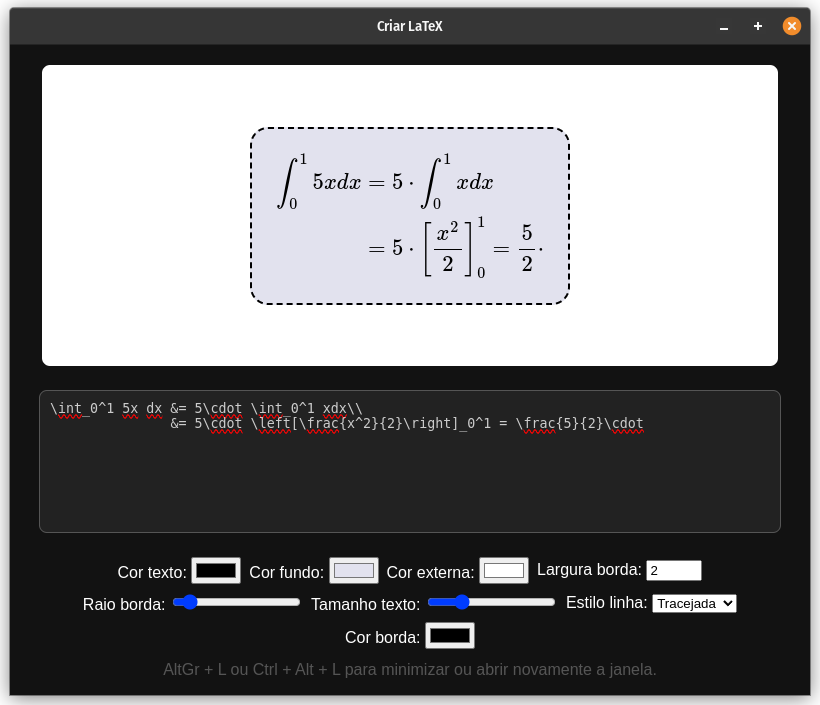

# Fast Latex

<p align="center">
  
</p>

## Demonstração

<p align="center">
  
</p>

## Introdução

O Fast Latex é um aplicativo desktop de código aberto para renderizar equações curtas ou alinhadas em LaTeX

Baixe o executável
[Download Fast LaTeX v1.0](https://github.com/jefersonapps/fast-latex/releases)

## Como executar em ambiente de desenvolvimento

- Instale o node js.
- Configure o pnpm como gerenciador de pacotes para evitar bugs: https://pnpm.io/installation
- Rode na pasta raíz do projeto no terminal `pnpm install`, em seguida, rode `pnpm start`

## Como usar

1. Clique no app de bandeja: O ícone aparecerá na banjeja do sistema.
2. Clique em Criar LaTeX: Uma janela será aberta permitindo digitar uma equação LaTeX.
3. Tire print da equação renderizada: Use seu app de captura de tela preferido para capturar a região da tela com a equação para utilizar onde quiser.

Dica: Após abrir a tela `Criar LaTeX` pela primeira vez, você pode usar o atalho Shift + L (ou o equivakente no seu sistema) para minimizar ou retomar com a tela de renderização LaTeX.

## Como gerar um build

Para gerar um build para seu aplicativo Electron usando Electron Builder e pnpm, siga estas etapas:

1. Instale as dependências do projeto:

```
pnpm i
```

2. Execute o seguinte comando para gerar um build para sua plataforma atual:

```
pnpm run build
```

Isso gerará um build para sua plataforma atual no diretório `build`. Você pode encontrar o executável do aplicativo no subdiretório apropriado para sua plataforma.

## Contribuindo

O Fast Latex é um projeto de código aberto e contribuições são bem-vindas. Você pode contribuir relatando problemas, sugerindo recursos ou enviando solicitações de pull no repositório do GitHub: https://github.com/jefersonapps/fast-latex.git

## Licença

O Fast Latex é licenciado sob a licença MIT.
